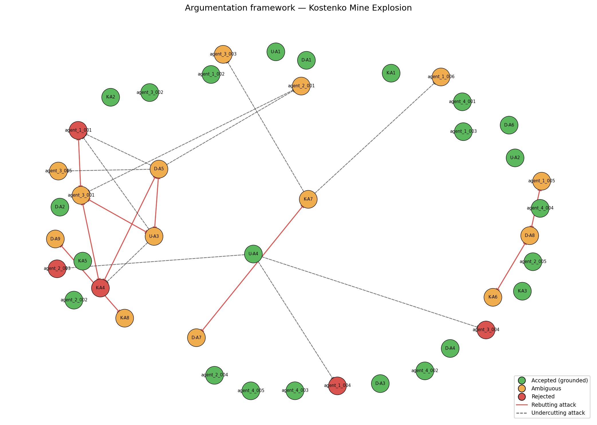

# Investigation Report — Kostenko Mine Explosion

**Date of incident:** 2023-10-28  
**Run ID:** `kostenko_v6_20260511_191059_423112`

---

## 1. Incident summary

The Kostenko Mine Explosion occurred on October 28, 2023, at the Kostenko Mine operated by ArcelorMittal Temirtau in Kazakhstan. The incident began with a fire that ignited methane, leading to a catastrophic explosion. The explosion resulted in multiple casualties, with a total of 12 miners confirmed dead and several others injured. Following the incident, the mine was evacuated, and a comprehensive investigation was initiated to determine the causes and contributing factors of the disaster. The investigation involved expert teams from various organizations, including Usembekov Meiramбек Sabdenovich (KarTU im. Abylkas Saginov), the Kolikov-Meshcheryakov Joint Expert Conclusion (NUST MISIS), and DMT GmbH & Co. KG, who collaborated over a period of several weeks to analyze the evidence and provide their findings.

## 2. Classification and precedents

The primary classification of the accident is a methane explosion, with secondary classifications including underground gas fire. The dominant cause categories identified include TC-01 (methane accumulation) and TC-02 (mechanical ignition source), supported by multiple arguments from expert sources such as D-A1, K-A2, and U-A3. 

Two relevant precedents were identified: PREC-2021-04 (Shaktha Listvyazhnaya) and PREC-2024-01 (Shaktha Alardinskaya). The first precedent involved a methane explosion that resulted in 51 fatalities, highlighting the severe consequences of methane accumulation and ignition, similar to the current case. The second precedent involved an underground gas fire caused by a roof fall, demonstrating the dangers associated with gas release in mining operations.

## 3. Accepted conclusions

### Ignition Source
The investigation concluded that the ignition source remains undetermined, with the most probable category being mechanical sparks from equipment. Arguments D-A5 and U-A3 highlight that while mechanical sparking is a potential ignition source, the specific source cannot be definitively identified. This conclusion is supported by the lack of direct evidence linking any specific item to the ignition event.

### Methane Source
It was accepted that the primary source of elevated methane levels in the upper longwall was the K2 companion seam, which was continuously releasing methane into the goaf near the longwall face. This conclusion is supported by arguments D-A1 and K-A2, which both emphasize the geological conditions that facilitated methane release due to abutment pressure decompression.

### Ventilation
The investigation found that while the ventilation system was operating within design parameters, it created structural vulnerabilities that allowed for methane accumulation in stagnant zones. This conclusion is supported by arguments D-A3 and U-A4, which indicate that the ventilation design did not adequately prevent methane build-up in critical areas.

## 4. Rejected hypotheses

The hypothesis that the ignition source was due to sparking from the armored face conveyor (AFC) chain, as proposed by K-A4, was rejected. This argument was defeated by U-A3, which presented a viable alternative suggesting that the ignition could have been caused by an angle grinder or other external sources. The evidence provided by K-A4 did not sufficiently exclude these alternatives, leading to its rejection. Additionally, the argument that ventilation was operating effectively but allowed for methane accumulation (agent_1_004) was also rejected due to the conflicting evidence from agent_2_003, which highlighted inadequate planning and execution of ventilation measures.

## 5. Unresolved questions

### Genuinely Contested Arguments
The investigation identified several ambiguities regarding the ignition source and explosion dynamics. D-A5 posits that the ignition source remains unknown, while U-A3 suggests the angle grinder could be a potential cause, leading to conflicting interpretations of the evidence. Additionally, the sequence of explosions remains contested, with D-A7 asserting a multi-stage explosion involving both methane and coal dust, while K-A7 provides an alternative perspective on the explosion's dynamics. These competing positions reflect the complexity of the incident and the need for further investigation.

### Open Questions
The original investigators raised several open questions that remain unresolved: 
1. Was the shearer operating at the time of ignition? 
2. Was the angle grinder used at or near the ignition location (sections 142-145)? 
3. What was the actual CH4 concentration distribution in the goaf and crosscut 13 immediately before the explosion? 
4. Were post-accident coal dust samples from conveyor lines explosive? 
5. What was the exact sequence of explosion propagation through the mine? 
These questions underscore the need for additional data and analysis to clarify the circumstances surrounding the accident.

## 6. Argumentation graph

Node colors: **green** = accepted (grounded extension), **orange** = ambiguous (in some preferred extension but not all), **red** = rejected (in no preferred extension). Edges: **solid red** = rebutting attack, **dashed** = undercutting attack.

## 7. Regulatory violations

### REG-01: Methane Monitoring Compliance
The mine failed to comply with methane monitoring limits, as evidenced by elevated methane concentrations reaching 17.9% in section 140. Continuous monitoring of CH4 concentration is mandated, and non-compliance contributed to the accident.

### REG-02: Ventilation Design Compliance
The ventilation design did not meet regulatory requirements, allowing for methane accumulation in stagnant zones. The evidence indicates that the ventilation scheme created vulnerabilities that could have been mitigated with proper design.

### REG-03: Degasification Compliance
Failure to conduct required degasification of the K2 seam contributed to uncontrolled methane release. The absence of pre-drainage boreholes violated regulations aimed at preventing such hazards.

### REG-05: Equipment Certification
The presence of non-explosion-proof equipment, including an angle grinder and flammable materials, violated safety regulations. This non-compliance significantly increased the ignition risk and was a critical factor in the incident. Compliance with these regulations could have mitigated the severity of the accident.

---

## Summary counts

| Metric | Value |
|-|-|
| combined_arguments | 42 |
| expert_arguments | 21 |
| agent_arguments | 21 |
| attacks_detected | 29 |
| supports_detected | 30 |
| accepted | 23 |
| ambiguous | 14 |
| rejected | 5 |
| preferred_extensions | 16 |

_Reproducible from run artifacts in `runs/kostenko_v6_20260511_191059_423112/`._