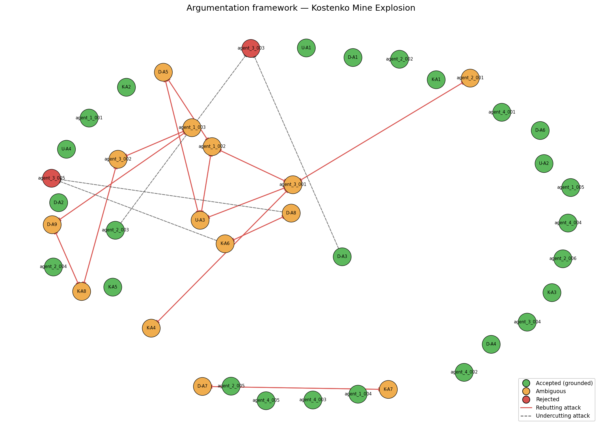

# Investigation Report — Kostenko Mine Explosion

**Date of incident:** 2023-10-28  
**Run ID:** `kostenko_v6_20260515_171033_139395`

---

## 1. Incident summary

The Kostenko Mine Explosion occurred on October 28, 2023, at the Kostenko Mine, ArcelorMittal Temirtau, Kazakhstan. The incident involved a fire and subsequent explosion, resulting in casualties and damage. The investigation was conducted by a team of experts, including Usembekov Meiramбек Sabdenovich (U), Kolikov-Meshcheryakov Joint Expert Conclusion (K), and DMT GmbH & Co. KG (D). The team collected data and evidence from various sources, including mine records, witness testimony, and physical inspections [U-A1, K-A1, D-A1]. The incident sequence began with a fire at 02:24, followed by an explosion at 02:43, which propagated through the mine, causing extensive damage and loss of life [D-A6, K-A6].

## 2. Classification and precedents

The primary accident type was classified as a methane explosion, with secondary types including underground gas fire [TC-01, TC-02]. The dominant cause categories driving this classification include methane accumulation and mechanical ignition source [TC-01, TC-02] [D-A1, K-A2]. The top-ranked precedent match was the Shaktha Listvyazhnaya accident, which shared similar cause categories, including methane accumulation and ignition source [PREC-2021-04]. The Jaccard overlap score for this precedent was 0.0909, indicating a significant similarity between the two incidents [PREC-2021-04].

## 3. Accepted conclusions

The accepted conclusions include the following topics: Ignition source, Methane source, Spontaneous combustion, and Ventilation. The ignition source was determined to be mechanical sparks from the armored face conveyor (AFC) chain [agent_1_002, K-A4]. The methane source was identified as the K2 companion seam, which released gas into the sub-conveyor zone [D-A1, K-A2, agent_1_001]. Spontaneous combustion was excluded as a cause [U-A2, D-A4, K-A3]. The ventilation system was found to be operating within design parameters, but the combined scheme created a stagnant sub-conveyor zone where methane accumulated [D-A3, U-A4, agent_1_005]. These conclusions are supported by multiple sources, including expert arguments and agent outputs [SUP-V5-001, SUP-V5-002, SUP-V5-003].

## 4. Rejected hypotheses

The rejected hypotheses include the following: The hypothesis that the ignition source was an angle grinder or aerosol can was rejected due to lack of conclusive evidence [U-A3, ATK-V5-001]. The hypothesis that the explosion was caused by a coal dust explosion was also rejected, as the evidence suggests that methane was the primary fuel [D-A9, ATK-V5-012]. These rejections are based on attacks from other arguments, which provided alternative explanations or contradictory evidence [ATK-V5-002, ATK-V5-003].

## 5. Unresolved questions

The genuinely contested arguments include the following topics: Ignition source and Explosion type. The evidence supports both mechanical sparks and angle grinder/aerosol as possible ignition sources [U-A3, agent_1_002]. The explosion type is also contested, with some arguments suggesting a primary coal dust explosion and others a primary methane explosion [D-A9, K-A8]. The open questions from the original investigators include: Was the shearer operating at the time of ignition? Was the angle grinder used at or near the ignition location? What was the actual CH4 concentration distribution in the goaf and crosscut 13 immediately before the explosion? [OQ-1, OQ-2, OQ-3].

## 6. Argumentation graph

Node colors: **green** = accepted (grounded extension), **orange** = ambiguous (in some preferred extension but not all), **red** = rejected (in no preferred extension). Edges: **solid red** = rebutting attack, **dashed** = undercutting attack.

## 7. Regulatory violations

The regulatory findings include the following violations: REG-01 (methane monitoring limits and automatic cutoff), REG-02 (ventilation scheme design and airflow requirements), REG-03 (degasification of companion seams), and REG-05 (explosion-proof equipment requirements). The mine did not comply with these regulations, which contributed to the accident [agent_4_001, agent_4_002, agent_4_003, agent_4_004]. The violations were causally significant, as compliance would have prevented or mitigated the accident. The regulatory context and evidence supporting these findings are detailed in the agent outputs [REG-01, REG-02, REG-03, REG-05].

---

## Summary counts

| Metric | Value |
|-|-|
| combined_arguments | 42 |
| expert_arguments | 21 |
| agent_arguments | 21 |
| attacks_detected | 30 |
| supports_detected | 21 |
| accepted | 26 |
| ambiguous | 14 |
| rejected | 2 |
| preferred_extensions | 32 |

_Reproducible from run artifacts in `runs/kostenko_v6_20260515_171033_139395/`._