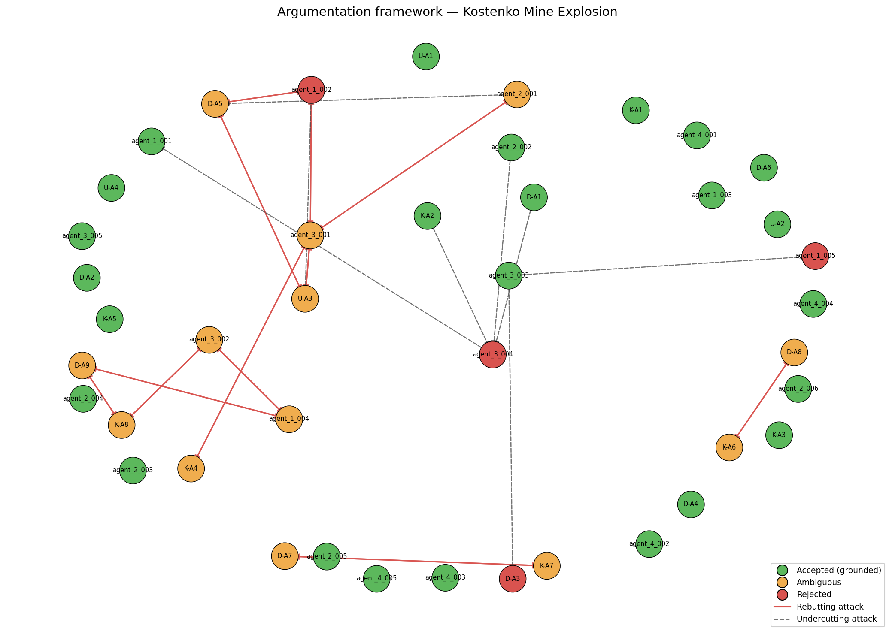

# Investigation Report — Kostenko Mine Explosion

**Date of incident:** 2023-10-28  
**Run ID:** `kostenko_v6_20260515_171757_180396`

---

## 1. Incident summary

The Kostenko Mine Explosion occurred on October 28, 2023, at the ArcelorMittal Temirtau mine in Kazakhstan. The incident involved a fire and subsequent explosion that resulted in casualties and damage. The investigation was conducted by a team of experts, including Usembekov Meiramбек Sabdenovich (U), Kolikov-Meshcheryakov Joint Expert Conclusion (K), and DMT GmbH & Co. KG (D). The team collected data and evidence from various sources, including mine records, witness statements, and physical inspections [U-A1, K-A1, D-A1]. The incident sequence began with a fire in the upper part of the longwall, followed by a methane explosion that propagated through the mine [D-A6, K-A7].

## 2. Classification and precedents

The primary accident type was classified as a methane explosion, with secondary types including underground gas fire [TC-01, TC-02]. The dominant cause categories driving this classification were methane accumulation and mechanical ignition source [TC-01, TC-02]. Precedent matches included the Shaktha Listvyazhnaya accident (PREC-2021-04) and the Shaktha Alardinskaya accident (PREC-2024-01), which shared similarities with the Kostenko Mine Explosion in terms of methane accumulation and ignition sources [PREC-2021-04, PREC-2024-01].

## 3. Accepted conclusions

The accepted conclusions include the identification of the K2 companion seam as the primary source of methane [K-A2, D-A1, agent_1_001]. The ignition source was likely mechanical sparking from the armored face conveyor (AFC) chain [K-A4, agent_1_002]. Spontaneous combustion was excluded as a cause [U-A2, K-A3, D-A4]. The ventilation system was operating within design parameters, but the combined scheme created a stagnant zone where methane accumulated [U-A4, D-A3, agent_1_005]. The explosion sequence involved a methane deflagration followed by a coal dust explosion [D-A7, agent_1_004].

## 4. Rejected hypotheses

The rejected hypotheses include the possibility of electrical equipment malfunction as an ignition source [K-A5, ATK-V5-005]. The hypothesis that the explosion was driven primarily by coal dust was also rejected [K-A8, ATK-V5-013]. The argument that the K2 seam was not the sole source of methane was also rejected [agent_3_004, ATK-V5-017].

## 5. Unresolved questions

The unresolved questions include the exact sequence of explosion propagation through the mine [OQ-5]. The question of whether the shearer was operating at the time of ignition remains unanswered [OQ-1]. The distribution of CH4 concentration in the goaf and crosscut 13 immediately before the explosion is also unknown [OQ-3].

## 6. Argumentation graph

Node colors: **green** = accepted (grounded extension), **orange** = ambiguous (in some preferred extension but not all), **red** = rejected (in no preferred extension). Edges: **solid red** = rebutting attack, **dashed** = undercutting attack.

## 7. Regulatory violations

The regulatory violations include non-compliance with REG-01 (methane monitoring limits and automatic cutoff) [agent_4_001]. The mine's ventilation scheme did not meet the requirements of REG-02 (ventilation scheme design and airflow requirements) [agent_4_002]. The mine failed to conduct pre-drainage boreholes for the companion seam, violating REG-03 (degasification of companion seams) [agent_4_003]. The use of non-explosion-proof equipment violated REG-05 (explosion-proof equipment requirements) [agent_4_004].

---

## Summary counts

| Metric | Value |
|-|-|
| combined_arguments | 42 |
| expert_arguments | 21 |
| agent_arguments | 21 |
| attacks_detected | 32 |
| supports_detected | 24 |
| accepted | 25 |
| ambiguous | 13 |
| rejected | 4 |
| preferred_extensions | 16 |

_Reproducible from run artifacts in `runs/kostenko_v6_20260515_171757_180396/`._