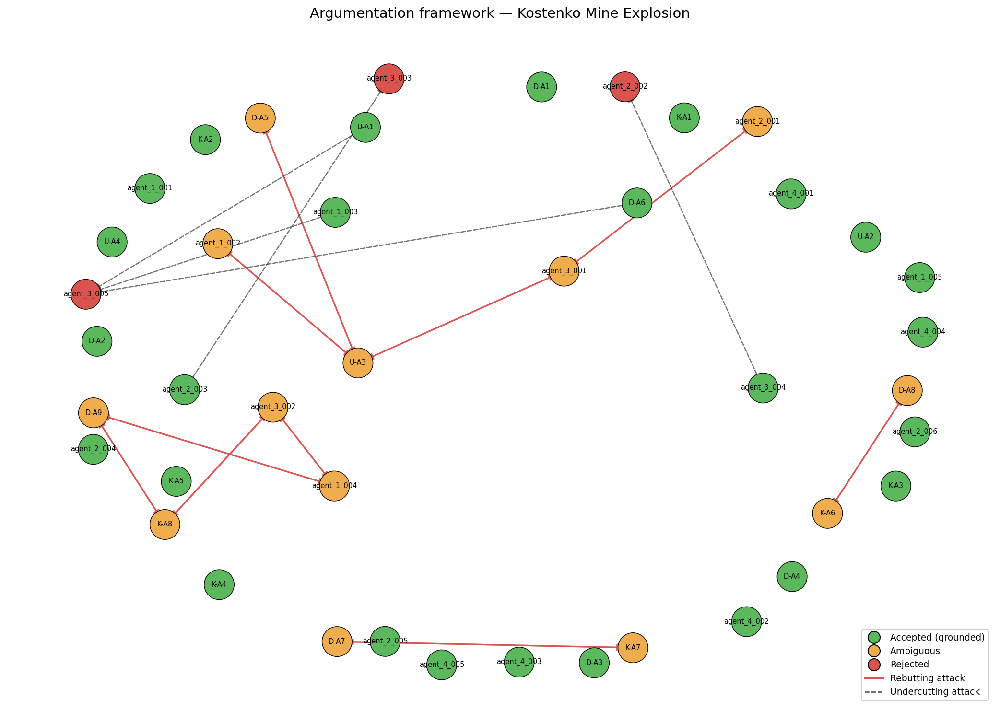

# Investigation Report — Kostenko Mine Explosion

**Date of incident:** 2023-10-28  
**Run ID:** `kostenko_v6_20260515_172822_319353`

---

## 1. Incident summary

The Kostenko Mine Explosion occurred on October 28, 2023, at the Kostenko Mine, operated by ArcelorMittal Temirtau, in Kazakhstan. The incident involved a fire and subsequent explosion, resulting in casualties and damage. The investigation was conducted by a team of experts, including Usembekov Meiramбек Sabdenovich (U), Kolikov-Meshcheryakov Joint Expert Conclusion (K), and DMT GmbH & Co. KG (D). The experts collected data and evidence over several months to determine the cause of the accident. According to [U], [K], and [D], the mine's location and geology played a significant role in the accident. The investigation aimed to determine the cause of the fire and explosion, the sources of elevated methane release, the possible ignition source, and the location of the fire and explosion. As noted by [U-A1], the initial ignition occurred in the upper part of longwall 48K3-Z, in the area of sections 142-145.

## 2. Classification and precedents

The primary accident type was classified as a methane explosion, with secondary types including underground gas fire. The dominant cause categories driving this classification were TC-01 methane accumulation and TC-02 mechanical ignition source, as cited in [D-A1] and [K-A4]. The ranked precedent matches included PREC-2021-04 (Shaktha Listvyazhnaya) and PREC-2024-01 (Shaktha Alardinskaya), with Jaccard overlap scores of 0.0909 and 0.0769, respectively. These precedents were analogous to the present case due to similar methane accumulation and ignition source mechanisms, as noted in [D-A2] and [K-A2].

## 3. Accepted conclusions

The system's accepted conclusions included the following topics: Ignition source, Methane source, Spontaneous combustion, and Ventilation. The accepted conclusion on ignition source was that the most probable ignition mechanism was a mechanical spark generated by the armored face conveyor (AFC) chain operating within the methane-rich sub-conveyor zone, as cited in [K-A4] and [agent_1_002]. The accepted conclusion on methane source was that the explosive methane originated from the K2 companion seam, which released gas into the sub-conveyor zone of the upper longwall due to abutment-pressure-induced fracturing and the lack of dedicated borehole drainage, as cited in [D-A1] and [agent_1_001]. The accepted conclusion on spontaneous combustion was that it was excluded as a cause, as cited in [U-A2] and [K-A3]. The accepted conclusion on ventilation was that the overall ventilation quantities met design specifications, but the 1K-N-N-vt combined scheme created a stagnant sub-conveyor zone where methane accumulated to explosive levels, as cited in [D-A3] and [agent_1_005].

## 4. Rejected hypotheses

The rejected arguments included the hypothesis that the ignition source was an external source, such as an angle grinder or aerosol can, as cited in [U-A3]. This hypothesis was defeated by [K-A4] and [agent_1_002], which provided evidence for the AFC sparking mechanism. Another rejected argument was that the ventilation system's design was adequate, but its operation was suboptimal, as cited in [agent_3_003]. This argument was defeated by [D-A3] and [agent_1_005], which provided evidence for the combined scheme's role in creating stagnant zones.

## 5. Unresolved questions

The genuinely contested arguments included the topic of explosion type, with competing positions on whether the primary explosion was driven by methane or coal dust, as cited in [K-A8] and [D-A9]. The evidence supported both positions, and the system's ambiguity classification corroborated the related arguments. The open questions from the original investigators included OQ-1 (Was the shearer operating at the time of ignition?), OQ-2 (Was the angle grinder used at or near the ignition location?), and OQ-3 (What was the actual CH4 concentration distribution in the goaf and crosscut 13 immediately before the explosion?), as noted in [D] and [K].

## 6. Argumentation graph

Node colors: **green** = accepted (grounded extension), **orange** = ambiguous (in some preferred extension but not all), **red** = rejected (in no preferred extension). Edges: **solid red** = rebutting attack, **dashed** = undercutting attack.

## 7. Regulatory violations

The regulatory findings included violations of REG-01 (Methane monitoring limits and automatic cutoff), REG-02 (Ventilation scheme design and airflow requirements), and REG-03 (Degasification of companion seams). The mine failed to comply with REG-01 by not ensuring continuous monitoring of CH4 concentration in the longwall face, outgoing air stream, and goaf, as cited in [agent_4_001]. The mine's ventilation design did not comply with REG-02, which requires specific design measures to prevent stagnant methane zones, as cited in [agent_4_002]. The mine failed to conduct pre-drainage of the companion seam, as required by REG-03, as cited in [agent_4_003]. These violations were causally significant, as compliance would have prevented or mitigated the accident, as noted in [agent_4_001] and [agent_4_002].

---

## Summary counts

| Metric | Value |
|-|-|
| combined_arguments | 42 |
| expert_arguments | 21 |
| agent_arguments | 21 |
| attacks_detected | 25 |
| supports_detected | 22 |
| accepted | 26 |
| ambiguous | 13 |
| rejected | 3 |
| preferred_extensions | 24 |

_Reproducible from run artifacts in `runs/kostenko_v6_20260515_172822_319353/`._