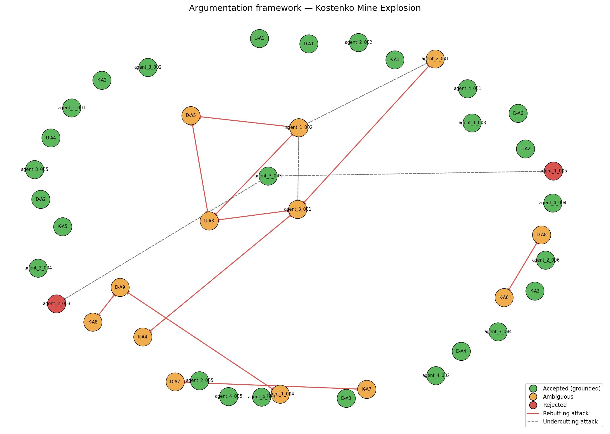

# Investigation Report — Kostenko Mine Explosion

**Date of incident:** 2023-10-28  
**Run ID:** `kostenko_v6_20260515_173447_867193`

---

## 1. Incident summary

The Kostenko Mine Explosion occurred on October 28, 2023, at the Kostenko Mine, ArcelorMittal Temirtau, Kazakhstan. The incident involved a fire and subsequent explosion, resulting in casualties and damage. The investigation was conducted by a team of experts, including Usembekov Meiramбек Sabdenovich (U), Kolikov-Meshcheryakov Joint Expert Conclusion (K), and DMT GmbH & Co. KG (D). The experts collected data and evidence from various sources, including mine records, witness testimony, and physical inspections. The investigation aimed to determine the cause of the fire and explosion, identify the sources of elevated methane release, and assess the role of seismic activity [U-A1, K-A1, D-A1].

## 2. Classification and precedents

The primary accident type was classified as a methane explosion, with secondary types including underground gas fire. The dominant cause categories driving this classification were TC-01 methane accumulation and TC-02 mechanical ignition source [D-A1, K-A2, agent_1_001]. The ranked precedent matches included PREC-2021-04 (Shakhta Listvyazhnaya) and PREC-2024-01 (Shakhta Alardinskaya), with Jaccard overlap scores of 0.0909 and 0.0769, respectively. These precedents were analogous to the present case due to similar methane accumulation and ignition source mechanisms [PREC-2021-04, PREC-2024-01].

## 3. Accepted conclusions

The accepted conclusions included the identification of the K2 companion seam as the primary source of methane [K-A2, D-A1, agent_1_001]. The ignition source was determined to be a mechanical spark, likely generated by the armored face conveyor (AFC) chain [K-A4, agent_1_002]. Spontaneous combustion was excluded as a cause [U-A2, D-A4, K-A3]. The ventilation system was operating within design parameters, but the combined scheme created a stagnant sub-conveyor zone where methane accumulated [U-A4, D-A3, agent_1_005]. The explosion sequence involved a methane deflagration, with coal dust contributing as a secondary enhancer [agent_1_004, agent_3_002].

## 4. Rejected hypotheses

The rejected hypotheses included the possibility of spontaneous combustion as an ignition source [U-A2, D-A4, K-A3] and the idea that the explosion was driven primarily by coal dust [K-A8, D-A9]. The argument that the ignition source was unknown [D-A5] was also rejected in favor of the mechanical spark hypothesis [K-A4, agent_1_002].

## 5. Unresolved questions

The unresolved questions included the exact sequence of explosion propagation through the mine [OQ-5] and the role of coal dust in the explosion [OQ-4]. The system's ambiguity classification corroborated the open questions from the original investigators, including the possibility of alternative ignition sources [OQ-1, OQ-2] and the need for further investigation into the methane concentration distribution in the goaf and crosscut 13 [OQ-3].

## 6. Argumentation graph

Node colors: **green** = accepted (grounded extension), **orange** = ambiguous (in some preferred extension but not all), **red** = rejected (in no preferred extension). Edges: **solid red** = rebutting attack, **dashed** = undercutting attack.

## 7. Regulatory violations

The regulatory findings included violations of REG-01 (methane monitoring limits and automatic cutoff), REG-02 (ventilation scheme design and airflow requirements), and REG-03 (degasification of companion seams). The mine failed to ensure continuous monitoring of CH4 concentration in the longwall face, outgoing air stream, and goaf, and the ventilation scheme did not prevent methane accumulation in sub-conveyor zones [agent_4_001, agent_4_002]. The mine also failed to conduct pre-drainage boreholes for the companion seam, contributing to the methane release and subsequent explosion [agent_4_003].

---

## Summary counts

| Metric | Value |
|-|-|
| combined_arguments | 42 |
| expert_arguments | 21 |
| agent_arguments | 21 |
| attacks_detected | 24 |
| supports_detected | 31 |
| accepted | 27 |
| ambiguous | 13 |
| rejected | 2 |
| preferred_extensions | 32 |

_Reproducible from run artifacts in `runs/kostenko_v6_20260515_173447_867193/`._