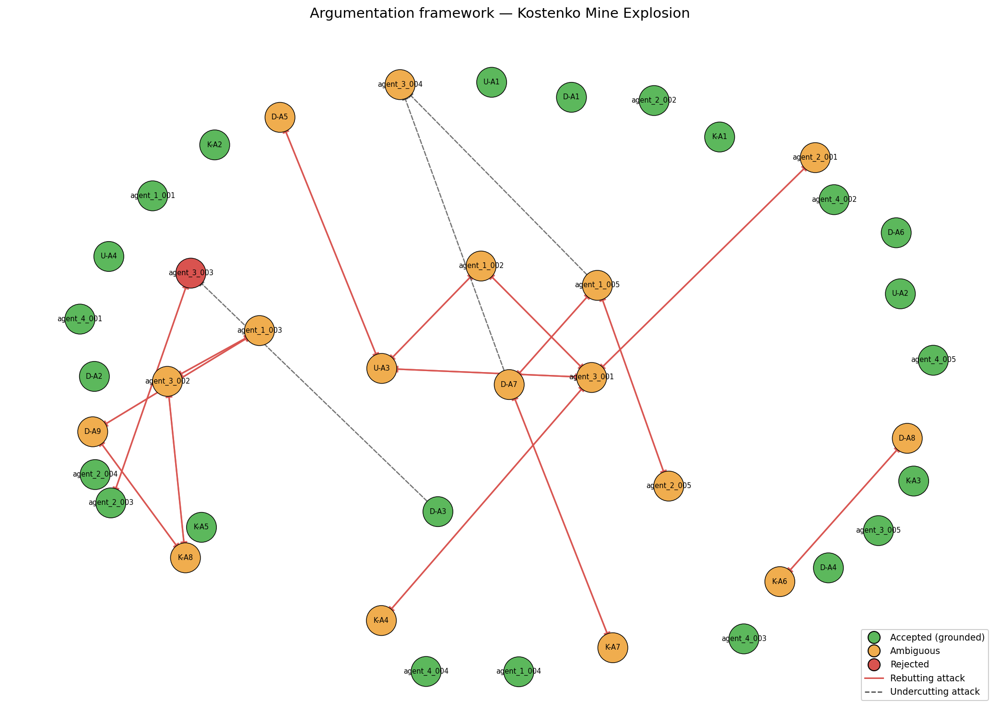

# Investigation Report — Kostenko Mine Explosion

**Date of incident:** 2023-10-28  
**Run ID:** `kostenko_v6_20260515_173850_754463`

---

## 1. Incident summary

The Kostenko Mine Explosion occurred on October 28, 2023, at the Kostenko Mine, ArcelorMittal Temirtau, Kazakhstan. The incident involved a fire and subsequent explosion, resulting in casualties and damage. The investigation was conducted by a team of experts, including Usembekov Meiramбек Sabdenovich (U), Kolikov-Meshcheryakov Joint Expert Conclusion (K), and DMT GmbH & Co. KG (D). The team aimed to determine the cause of the fire and explosion, identify the sources of elevated methane release, and assess the role of seismic activity. [U], [K], [D]

## 2. Classification and precedents

The primary accident type was classified as a methane explosion, with secondary types including underground gas fire. The dominant cause categories driving this classification include TC-01 methane accumulation and TC-02 mechanical ignition source. [D-A1, K-A2, agent_1_001] The top precedent match was the Shaktha Listvyazhnaya accident, with a Jaccard overlap score of 0.0909 and shared cause categories including TC-01 methane accumulation. [PREC-2021-04]

## 3. Accepted conclusions

The accepted conclusions include: the explosive methane originated from the K2 companion seam, released into the sub-conveyor zone of the upper longwall by abutment-pressure-induced fracturing. [D-A1, K-A2, agent_1_001] The most probable ignition energy was a mechanical spark generated by the armored face conveyor (AFC) chain operating within the methane-rich sub-conveyor zone. [K-A4, agent_1_002] Spontaneous combustion of coal in the goaf is excluded as a cause. [U-A2, D-A4, K-A3] The ventilation system met design flow rates, but the 1K-N-N-vt combined scheme created a stagnant sub-conveyor pocket where methane accumulated. [D-A3, U-A4, agent_1_004]

## 4. Rejected hypotheses

The rejected hypotheses include: the ignition source was an angle grinder or aerosol can, as this was not conclusively supported by the evidence. [U-A3, ATK-V5-002] The explosion epicenter was in the lower part of the longwall, as this was contradicted by seismic data and other evidence. [K-A6, ATK-V5-009]

## 5. Unresolved questions

The unresolved questions include: the exact sequence of explosion propagation through the mine, and the actual CH4 concentration distribution in the goaf and crosscut 13 immediately before the explosion. [OQ-3, OQ-5] The system's ambiguity classification corroborated the open questions from the original investigators, including the role of the shearer and the presence of prohibited ignition-capable materials. [OQ-1, OQ-2]

## 6. Argumentation graph

Node colors: **green** = accepted (grounded extension), **orange** = ambiguous (in some preferred extension but not all), **red** = rejected (in no preferred extension). Edges: **solid red** = rebutting attack, **dashed** = undercutting attack.

## 7. Regulatory violations

The regulatory findings include: the mine failed to comply with REG-01, as the methane monitoring system did not automatically cutoff power to electrical equipment when the 1.0% CH4 threshold was reached. [agent_4_001] The mine's ventilation design did not meet the requirements of REG-02, as it failed to prevent methane accumulation in sub-conveyor zones. [agent_4_002] The mine failed to conduct pre-drainage boreholes for the companion seam, as required by REG-03. [agent_4_003]

---

## Summary counts

| Metric | Value |
|-|-|
| combined_arguments | 41 |
| expert_arguments | 21 |
| agent_arguments | 20 |
| attacks_detected | 33 |
| supports_detected | 23 |
| accepted | 23 |
| ambiguous | 17 |
| rejected | 1 |
| preferred_extensions | 36 |

_Reproducible from run artifacts in `runs/kostenko_v6_20260515_173850_754463/`._